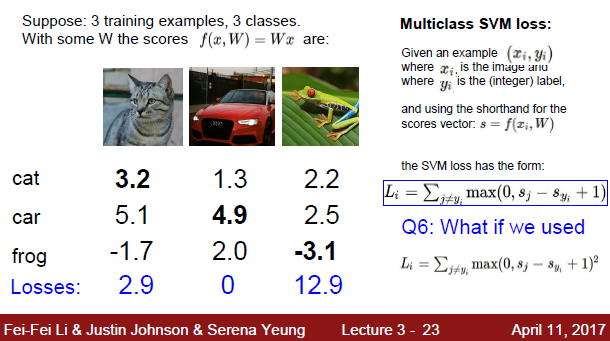

## cs231 lecture 6

- Q1. Non-Linearity(비선형)의 의미와 필요한 이유
- A1. 데이터가 복잡해지고, feature들의 차원이 증가하면서 데이터의 분포가 선형적이지 않고 비선형적으로 나타납니다. 단순한 선형의 boundary로는 표현이 불가능하기 때문에 비선형의 boundary가 필요하기 때문에 non-linear가 필요합니다.

    네트워크에 non-linearity activation function이 없으면 NN은 layer 수가 아무리 많아도 single layer perceptron처럼 작동합니다. 이 layer를 합하면 다른 linear function이 제공됩니다.

 

- Q2. tanh가 sigmoid보다 더 좋은 성능을 갖는 이유
  - A2. tanh는 zero-centered이기 때문입니다. 그 의미는 output의 mean이 0이 되는 경우, 정규화된다는 의미입니다.

       

      - 그렇다면 zero-centered 된 경우가 더 좋은 성능을 갖는 이유는 무엇일까요?

        training set에 대한 각 입력 변수의 평균이 0에 가까울 경우 converge가 일반적으로 더 빠릅니다. 이를 확인하려면 모든 입력이 양수인 극단적인 경우를 고려할 수 있습니다.

        첫 번째 가중치 레이어의 특정 노드에 대한 가중치는 `δx`에 비례하는 양만큼 업데이트됩니다. 여기서 `δ`는 해당 노드의 (스칼라) 오차이고 `x`는 입력 벡터입니다. 
    
        입력 벡터의 모든 구성 요소가 양수이면 노드에 공급되는 모든 가중치 업데이트는 동일한 부호(즉, `부호(δ)`)를 갖습니다. 
    
        결과적으로 이러한 가중치는 주어진 입력 패턴에 대해 모두 감소하거나 모두 함께 증가할 수 있습니다. 
        
        따라서 가중치 벡터가 방향을 변경해야 하는 경우 비효율적이고 매우 느린 지그재그로만 방향을 변경할 수 있습니다.

 

- Q3. ReLU의 문제점
- A3. ReLU의 가장 큰 문제점으로는 `Dying ReLU`가 있습니다. ReLU는 가중치를 더 작은 값으로 만들어 모든 입력에 대해 z_n < 0이 되도록 하는 일부 input batch에 대한 gradient step로 인해 살아 있다가 죽을 수 있습니다.

